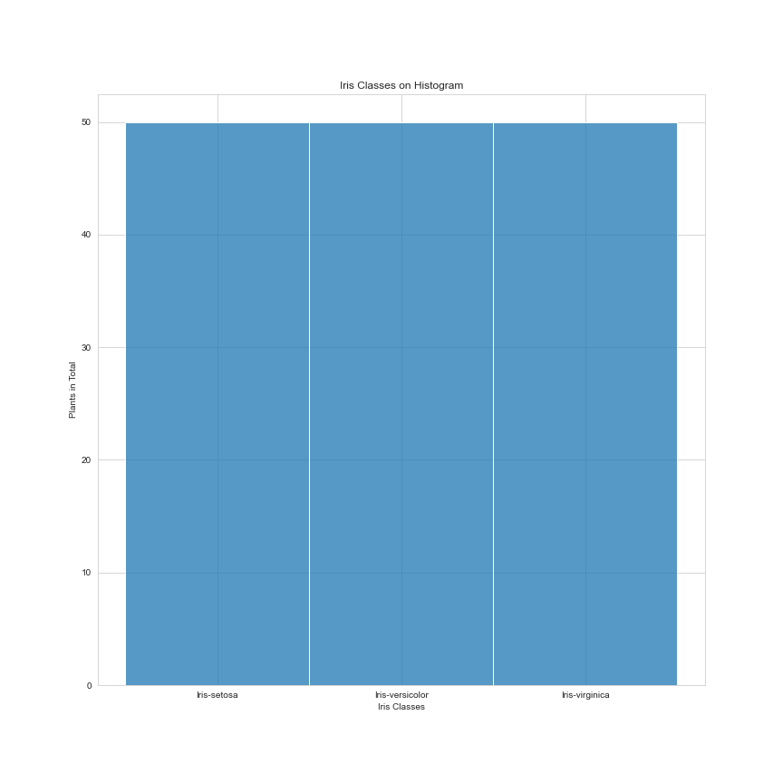

# Build Machine Learning Website with Flask

In this project, a website was created that allows predictions on Iris data by using the K-NN machine learning algorithm. First of all, a machine learning model that predicts iris data was created, and then this model was recorded through the pickle library. Afterwards, a web page was developed that allows us to guess through the pickle file.

     

## Data Set

Dataset is downloaded from [Kaggle](https://www.kaggle.com/uciml/iris).  Dataset has been manipulated by myself. It has **5 columns** and **151 rows with the header**.

| # | Column | Non-Null Count | Dtype |
|--|--|--|--|
| 0 | sepal length | 150 non-null | float64
| 1 | sepal width | 150 non-null | float64
| 2 | petal length | 150 non-null | float64
| 3 | petal width | 150 non-null | float64
| 4 | iris | 150 non-null | object

     

| Classes | Num of Variables |
|--|--|
| Iris-setosa  | 50 |
| Iris-versicolor | 50 |
| Iris-virginica | 50 |
|  |  |   

Name: iris, dtype: int64 

## Building Machine Learning Model

In this project, as stated in the title, results were obtained through classifiaction method - **K-Nearest Neighbors(KNN)**. 

### What is K-NN?

K-Nearest Neighbor (KNN) is a method for classifying cases based on their similarity to other cases (independent variables). Cases that are near each other are **"neighbors"**. Based on similar cases wit same class labels are near each other. We are calculading the distance with **Minkowski distance** or **Euclidean distance** method. Euclidean distance is the straight line distance between 2 data points in a plane. It is calculated using the Minkowski Distance formula by setting 'p' value to 2, thus, also known as the L2 norm distance metric.

You are free to visit [Machine Learning: Classification Models](https://medium.com/fuzz/machine-learning-classification-models-3040f71e2529) website for learn the methods better.

    from sklearn.neighbors import KNeighborsClassifier
    from sklearn.model_selection import KFold, cross_val_score
    
    knn = KNeighborsClassifier(n_neighbors=4, metric='minkowski')
    knn.fit(X, y)
    
    kfold = KFold(random_state=42, shuffle=True)
    cv_results = cross_val_score(knn, X, y, cv=kfold, scoring="accuracy")
    
    print(cv_results.mean())
    print(cv_results.std())

As a result, we have **0.9733333333333334** cross validation score with **0.024944382578492935** standard deviation.

---

Annotations will be added to the file...
