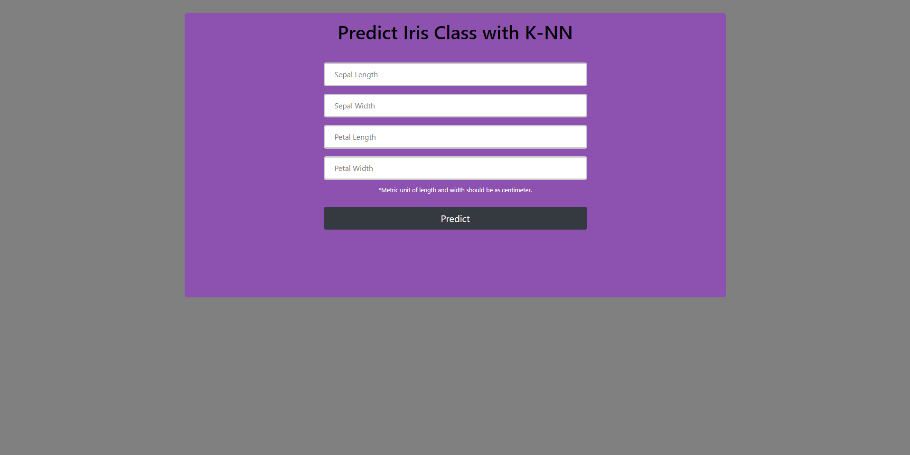

# Build Machine Learning Website with Flask

In this project, a website was created that allows predictions on Iris data by using the K-NN machine learning algorithm. First of all, a machine learning model that predicts iris data was created, and then this model was recorded through the pickle library. Afterwards, a web page was developed that allows us to guess through the pickle file.

     

## Data Set

Dataset is downloaded from [Kaggle](https://www.kaggle.com/uciml/iris).  Dataset has been manipulated by myself. It has **5 columns** and **151 rows with the header**.

| # | Column | Non-Null Count | Dtype |
|--|--|--|--|
| 0 | sepal length | 150 non-null | float64
| 1 | sepal width | 150 non-null | float64
| 2 | petal length | 150 non-null | float64
| 3 | petal width | 150 non-null | float64
| 4 | iris | 150 non-null | object

     

| Classes | Num of Variables |
|--|--|
| Iris-setosa  | 50 |
| Iris-versicolor | 50 |
| Iris-virginica | 50 |   

Name: iris, dtype: int64 

## Building Machine Learning Model

In this project, as stated in the title, results were obtained through classifiaction method - **K-Nearest Neighbors(KNN)**. 

### What is K-NN?

K-Nearest Neighbor (KNN) is a method for classifying cases based on their similarity to other cases (independent variables). Cases that are near each other are **"neighbors"**. Based on similar cases wit same class labels are near each other. We are calculading the distance with **Minkowski distance** or **Euclidean distance** method. Euclidean distance is the straight line distance between 2 data points in a plane. It is calculated using the Minkowski Distance formula by setting 'p' value to 2, thus, also known as the L2 norm distance metric.

You are free to visit [Machine Learning: Classification Models](https://medium.com/fuzz/machine-learning-classification-models-3040f71e2529) website for learn the methods better.

### Building Classifier

After briefly observing what the KNN algorithm is, you can see how the model is created via python through the code block below. We had mentioned number of neighbors to use by 4 for kneighbors.  After that we provide train/test indices to split data in train/test sets with KFold function.

    from sklearn.neighbors import KNeighborsClassifier
    from sklearn.model_selection import KFold, cross_val_score
    
    knn = KNeighborsClassifier(n_neighbors=4, metric='minkowski')
    knn.fit(X, y)
    
    kfold = KFold(random_state=42, shuffle=True)
    cv_results = cross_val_score(knn, X, y, cv=kfold, scoring="accuracy")
    
    print(cv_results.mean())
    print(cv_results.std())

As a result, we have **0.9733333333333334** cross validation score with **0.024944382578492935** standard deviation. After obtaining sufficient results, we saved our model as desired with the pickle library. Thanks to Pickle, we do not need to use machine learning algorithms over and over again. Now, our model or our classifier is ready to use in our app. 

    import pickle
    
    pickle_file = open('classifier.pkl', 'ab')
    pickle.dump(knn, pickle_file)                     
    pickle_file.close()

### Building App

After reaching this stage in a healthy way, a function was created to facilitate the estimation process. We can make our estimation easily and in a short time by means of the following function. This function is at the center of our estimation process in the **app.py** file.

    def predict_class(sepal_length, sepal_width, petal_length, petal_width):
    
        pickle_file = open('classifier.pkl', 'rb')     
        classifier = pickle.load(pickle_file)
    
        y_predict = classifier.predict([[sepal_length, 
                                         sepal_width, 
                                         petal_length, 
                                         petal_width]])[0]
    
        return class_map[y_predict]

In order to establish a logical link between the interface and the function, the function that fulfills the following POST and GET requests has been created.

    def index():
        irisClass=''
        if request.method == 'POST' and 'sepal_length_input' in request.form and 'sepal_width_input' in request.form and 'petal_length_input' in request.form and 'petal_width_input' in request.form:
            sepal_length = float(request.form.get('sepal_length_input'))
            sepal_width = float(request.form.get('sepal_width_input'))
            petal_length = float(request.form.get('petal_length_input'))
            petal_width = float(request.form.get('petal_width_input'))
            irisClass = predict_class(sepal_length, sepal_width, petal_length, petal_width)
        
        return render_template("index.html", irisClass=irisClass)

Below you can see the lines of code that are linked to the function we created in the index.html file. After the desired values ​​are entered, it performs the estimation process through the function and presents them to the user as an alert.

    <!-- Creating form -->
    <form action="/" method="POST">
        <input type="text" placeholder="Sepal Length" name="sepal_length_input"> 
        <input type="text" placeholder="Sepal Width" name="sepal_width_input"> 
        <input type="text" placeholder="Petal Length" name="petal_length_input"> 
        <input type="text" placeholder="Petal Width" name="petal_width_input"> 
        <small>*Metric unit of length and width should be as centimeter.</small> 
        <button type="submit" value="submit" class="btn btn-dark btn-lg">Predict</button>
    </form>
    
    

        &times;
        Predicted as <b>{{irisClass}}</b>
    

    

After all the spaces are filled (float) as desired and the predict button is pressed, the logical test (, ) will run and perform the estimation process. You can try another classifier methods such as Desicion Tree and SVM for the app.

## How to Run Code

Before running the code make sure that you have these libraries:

 - pandas 
 - time
 - sklearn
 - seaborn
 - warnings
 - matplotlib
 - pickle
 - flask
    
## Contact Me

If you have something to say to me please contact me: 

 - Twitter: [Doguilmak](https://twitter.com/Doguilmak) 
 - Mail address: doguilmak@gmail.com
 
